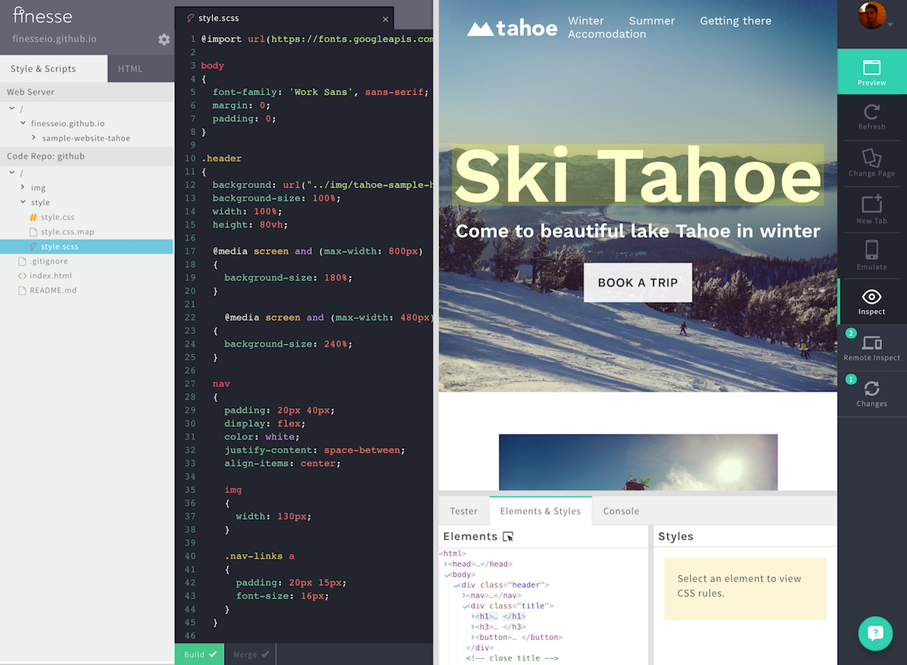
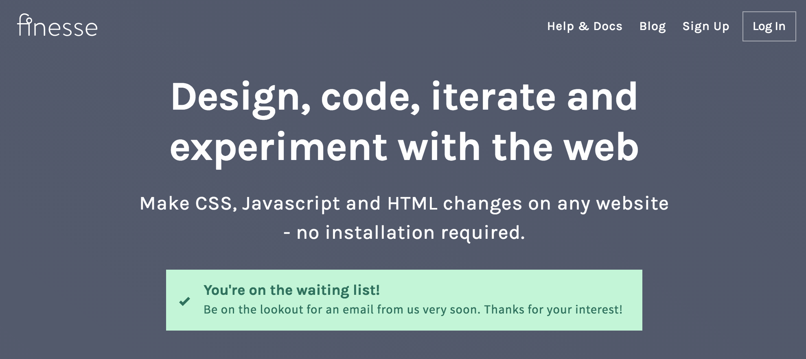

## Role
- Founder
- Front-end development
- Back-end development
- Information Architecture
- Cloud Infrastructure Architecture
{.role-list}

## Technologies
- NodeJS
- SCSS
- Javascript
- HTML
- HTTP Proxy
- DynamoDB
- Redis
{.technology-list}

- The IDE is a single-page app using websockets for fast client communication and notifications.
- I built a provisioning service using Node, AutoFS, and Sparse Disk Images. It creates user workspaces on-demand, and very quickly distributes these workspaces against an automatically scaling set of cloud instances.
- I created a secure preview signup, registration and authentication system, implemented in Express.
- Docker is used to run commands against user workspaces, orchestrated by a custom service using a set of queues for scheduling.
- Deepstream.io and redis is used for cross-service communication.

## What is it?
Finesse is a web app that I co-founded in order to solve a common workflow problem for designers and front-end developers.

Having managed teams of designers and developers working together, I often found that once projects were nearing completion or live, these teams wanted the ability to continue to make changes to front-end code in order to fix issues that had arisen through development against live data, devices and users.

The problem these teams encounter is that in order to contribute to the front-end code, they must configure, compile and run the back-end code and databases. This can be an impossible challenge.

Finesse solves that problem by running the website from any live location the website is at, and loading the front-end code from a private workspace in which the user can make edits. The user can then share their new version of the website with the rest of their team, or even push their changes back to the main codebase.

[Learn more about Finesse and sign-up to use it at finesse.io.](https://finesse.io)

:::: timeline
## Timeline{.timeline__title}

::: timeline__item
### 2016-05{.timeline__item-title}
MVP implementation of product complete. Began collecting beta signups.

:::

::::
