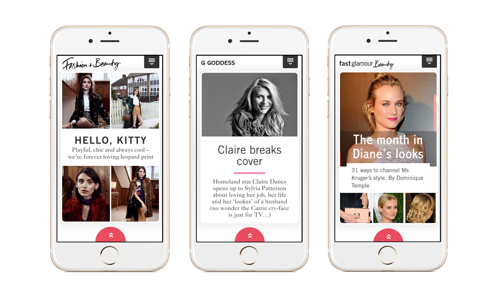

## Responsible for
- Creating a publishing workflow
- Creating an end-to-end prototype
- Hiring and managing front-end developers
- Briefing designers and critiquing prototypes
- Managing design and development
- Architecting a NodeJS queue management service and API
- iOS App Store provisioning, setup and app deployment

## Technologies
- NodeJS
- SCSS
- Javascript
- HTML
- Umbraco
- Adobe Experience Manager
- iTunes Connect
{.technology-list}

## What is it?

At a time where subscription-based monthly magazine content distributed through phone or tablet app-store's was either a direct PDF of a magazine, or one that was painstakingly laid out for each device still using a print design workflow, I pitched for the ability to re-imagine both the user-experience and the internal publishing workflow. The arguments laid out by myself consisted of the benefits of:
- Using responsive html to cater for all device sizes with a single build.
- Creating html templates for magazine articles with customizable layouts, and using a designer to make those template choices at content-creation time. This removed the intensive and short-reaching custom design process for each magazine issue, but still kept the design-controlled layout expertise.
- Storing the version of the content, and its layout, in a single place for web and apps, and being able to explore future content-discovery options.

It was also a challenge for me to get to a place where I could believe in the product. Having a passion for the web with it's deep-linking and instant discoverability through the web browser, I used this project as a way to guide a largely print-product company towards better digital practices whilst adhering to business requirements that restricted, for that moment, the content to be a monthly package sold through an app store.

This showed through the way I architected the workflow. The content was to be published in the brand's website content database, and its UX components that represent the content on the screen also be available on the website, as well as each article's taxonomy. This allowed the monthly content to be simultaneously published on the website, where it can be presented more naturally to the user: surfacing within different streams of content for some users, or as a more traditional monthly package for others. This was to open up new revenue streams and a continued experience for subscribers from print to web.

I hired and created a team to look at the gaps between the experience of a print magazine and the experience of content on a digital device. Through a process of analyzing content over several issues, we created reusable and skin-able html components to represent article content that was not simply straightforward paragraphs of text. They all came together to make a more immersive yet structured reading experience for different types of content.

I put a case forward that the content discoverability mechanisms are inherently different on digital formats than print. With a print magazine, readers often flip through a magazine at the order they choose tactilely (front to back, back to front, or starting in the middle. We therefore architected the navigation, the contents page and the cover page so that the user can get an overview of the entire magazine structure, instead of the teaser-like nature of the print counterpart. No matter where they start, a user can ascertain where in the bundle of content they were at, and where they could go, very quickly.

{.content-image}

On the software side, I learnt and educated the rest of the team, who were already skilled in javascript, how to use NodeJS to rapidly create an API publishing queue and scheduling service to ingest content from the website CMS and send it to multiple app publishing platforms, including Adobe Experience Manager.

:::: timeline
## Timeline{.timeline__title}

::: timeline__item
### 2015 - 2016{.timeline__item-title}
British Vogue, British GQ and British Glamour all have their *tablet* editions, as well as phone, replaced with this new responsive html-based system.
:::

::: timeline__item
### 2014-11{.timeline__item-title}
British Glamour is published on mobile in the App Store, the first to have a fully responsive monthly package with a completely interactive yet templated experience.

@[vimeo](121742698##303x540)

:::

::: timeline__item
### 2014-04{.timeline__item-title}
British GQ is published in the App Store using my team's publishing workflow, built in NodeJS.
:::

::::
