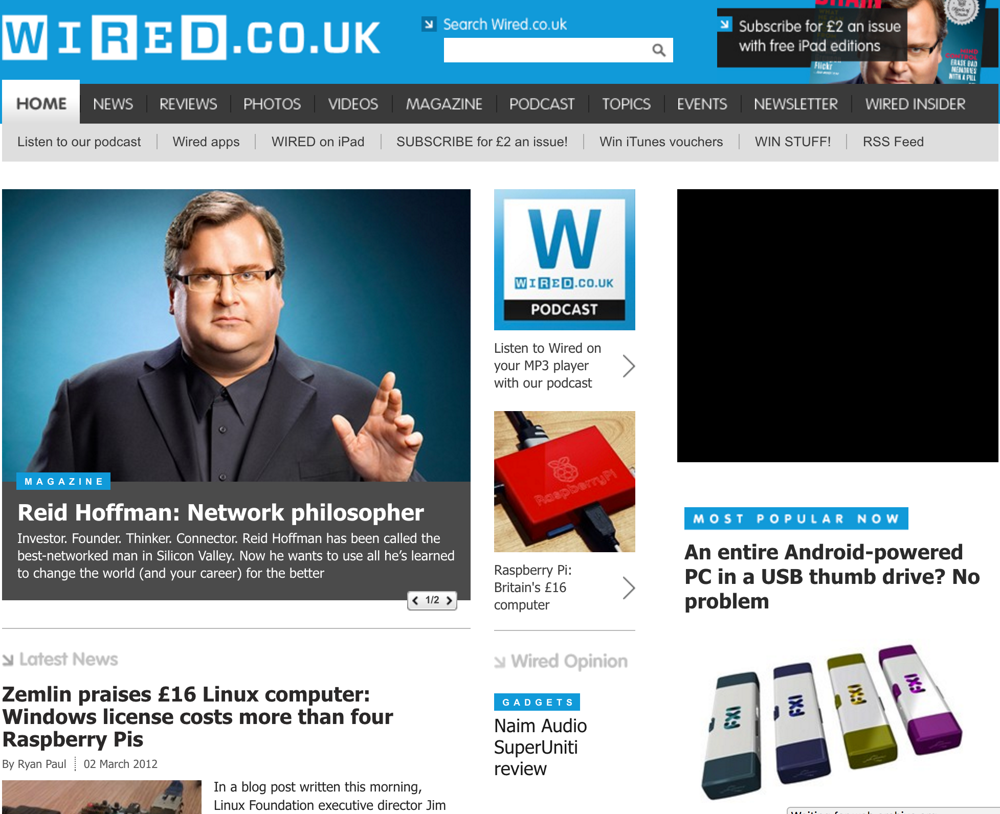

## Responsible For
- Full-stack software development and architecture
- Direct management of the development team
- Managing the UX and Design process
- Working with editorial and commercial teams to prioritize features
- Content structure and CMS configuration
- Server & Cloud Infrastructure architecture
- Build workflow & Continuous Integration implementation
- Analyzing user-journeys through analytics and sharing reports with other teams
{.role-list}

## Technologies
- C# (.net)
- SCSS
- Javascript
- HTML
- Web Proxy
- SQL Server
- Umbraco
- EC2 (ELB and Auto-Scaling)
- Google Analytics
{.technology-list}

## What is it?

I managed the team developing the wired.co.uk website, as well as contributing to the development of components for the site and the centralized platform. Wired.co.uk is a news and long-form feature website focused on the technology, design and science industries, as well as popular culture surrounding those topics.

With 1.7 million monthly users, we faced the performance challenges of a high-traffic website. I created a server architecture which ensured the site and it's publishing services ran smoothly across multiple cloud instances. I put in place policies which ensured a single developer team could manage operations through scaling automation and self-service tools.

Information Architecture is especially interesting on this product. The site has multiple content types with very different publishing frequencies. For example, daily news articles are published the most frequent but have the shortest-lived relevance. Long-form features are published just a couple times a month but could be relevant and interesting for readers for a long time. It was exciting to experiment with different ways to present streams of content to maximize user-engagement with the site. It was also rewarding to explore the intentions of different user-segments, such as those browsing the news compared to those looking for information on specific consumer products, and tailor the product to meet the needs of as many groups of users as possible, whilst maintaining a simple UX and a brand-worthy style.

:::: timeline
## Timeline{.timeline__title}

::: timeline__item
### 2014{.timeline__item-title}
Experimented with content discovery with new home and topic pages, in an effort to find the best way to present different *buckets* of content to different users.

These methods include:
- Automatic prioritization of content based on realtime analytics
- Automatic topic relations
- Single content-streams with differing presentation of content items
- Cross-page session preservation, including position within streams of content

{.timeline__item-image .--screenshot}
:::

::: timeline__item
### 2013{.timeline__item-title}
Managed the process to conceive of a more immersive reading experience, focusing on a responsive desktop and mobile design as well as removing redundant visual components. Maintained editorial ability to create these immersive experiences themselves within a Content Management System, with design-team support available.

@[vimeo](122073076##62)

:::

::: timeline__item
### 2012{.timeline__item-title}
Completely new website with custom low-latency routing and delivery, and editorial content platform. I led the development team, and I worked very closely with design, editorial and commercial teams on structure, information architecture and UX.

{.timeline__item-image .--screenshot}
:::

::::
